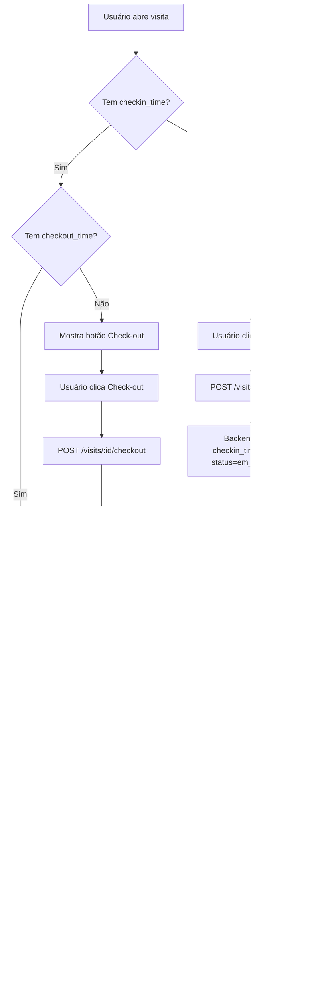

# Correções: Formulário Hotelaria e CheckIn/CheckOut

## Data: Outubro 2025

## Problemas Identificados e Soluções

### 1. ✅ Renomear Formulário de Hotelaria

**Problema:**
- Nome antigo: "CheckList Mestre de Diagnóstico e Viabilidade (Hotelaria)"
- Nome muito longo para o PDF

**Solução:**
- Novo nome: "CheckList Diagnóstico e Viabilidade - Hotelaria"
- Atualizado no PDF export (`backend/src/routes/forms-export.js`)
- Título mais conciso e profissional

**Arquivo Modificado:**
- `backend/src/routes/forms-export.js` (linha 442)

---

### 2. ✅ Corrigir Sobreposição do Título no PDF

**Problema:**
- O título "CHECKLIST MESTRE DE DIAGNOSTICO E VIABILIDADE" estava sobreposto ao cabeçalho
- Texto muito próximo do header com logo

**Solução:**
```javascript
// Antes:
doc.fontSize(14)
doc.text('CHECKLIST MESTRE DE DIAGNOSTICO E VIABILIDADE', PAGE.left, doc.y, ...)

// Depois:
doc.fontSize(13)  // Reduzido
doc.text('CHECKLIST DIAGNOSTICO E VIABILIDADE', PAGE.left, doc.y + 5, ...)  // +5 espaçamento
```

**Mudanças:**
- Reduzido tamanho da fonte de 14pt para 13pt
- Adicionado espaçamento de 5pt (`doc.y + 5`)
- Título mais curto

**Arquivo Modificado:**
- `backend/src/routes/forms-export.js` (linhas 441-442)

---

### 3. ✅ Auto-Preenchimento de Dados do Lead/Cliente

**Problema:**
- Formulário de Hotelaria exigia digitação manual de todos os dados do cliente
- Dados já existiam no cadastro do lead/cliente vinculado à visita
- Perda de tempo e possibilidade de erros de digitação

**Solução:**
Implementado auto-preenchimento inteligente que:

1. **Detecta se é formulário de Hotelaria:**
   ```javascript
   const isHotelariaForm = (res.data.title || '').toLowerCase().includes('hotelaria')
   ```

2. **Busca dados do cliente:**
   ```javascript
   const contactId = visit.customer_contact_id || visit.client_id || visit.lead_id
   const contactRes = await api.get(`/customer-contacts/${contactId}`)
   const contact = contactRes.data
   ```

3. **Preenche automaticamente os campos:**

   **Dados do Estabelecimento:**
   - `hotel_nome` / `estabelecimento_nome` ← `company_name` ou `name`
   - `hotel_endereco` / `estabelecimento_endereco` ← `address`
   - `hotel_contato` / `estabelecimento_responsavel` ← `contact_name` ou `name`
   - `hotel_telefone` / `estabelecimento_telefone` ← `phone`
   - `hotel_email` / `estabelecimento_email` ← `email`
   - `estabelecimento_cnpj` ← `tax_id`

   **Dados da Visita:**
   - `data_visita` / `visita_data` ← `visit.scheduled_date`
   - `horario_visita` ← `visit.scheduled_time`
   - `consultor_nome` / `visita_consultor` ← `visit.responsible.name`

**Benefícios:**
- ✅ Economia de tempo (não precisa digitar dados cadastrados)
- ✅ Eliminação de erros de digitação
- ✅ Dados sempre consistentes com o cadastro
- ✅ Melhora experiência do usuário

**Arquivo Modificado:**
- `frontend/src/components/VisitFormsPanel.jsx` (linhas 190-223)

---

### 4. ✅ Corrigir Persistência de CheckIn/CheckOut

**Problema:**
- Ao fazer CheckIn e sair da página de visita
- Ao retornar, o app solicitava CheckIn novamente
- Estado de `checkin_time` e `checkout_time` não eram persistidos
- Problema: dados em cache não eram atualizados

**Causa Raiz:**
```javascript
// Antes: Usava dados em cache
<IconButton onClick={() => setViewVisit(visit)}>
  <Visibility />
</IconButton>
```

**Solução:**
Recarregar visita do servidor **sempre** que o diálogo for aberto:

```javascript
// Depois: Recarrega do servidor
<IconButton onClick={async () => {
  try {
    // Buscar dados atualizados do servidor
    const res = await api.get(`/visits/${visit.id}`)
    setViewVisit(res.data)
  } catch (error) {
    // Fallback para cache se offline
    setViewVisit(visit)
  }
}}>
  <Visibility />
</IconButton>
```

**Como Funciona:**

1. **Usuário faz CheckIn:**
   ```
   POST /api/visits/:id/checkin
   ↓
   Backend atualiza: checkin_time, checkin_latitude, checkin_longitude, status='em_andamento'
   ↓
   Retorna visit atualizada
   ↓
   onVisitUpdated(response.data.visit) atualiza UI
   ```

2. **Usuário fecha e reabre o diálogo:**
   ```
   Clique em Visualizar
   ↓
   GET /api/visits/:id (busca dados frescos do banco)
   ↓
   setViewVisit(res.data) com checkin_time preenchido
   ↓
   VisitTimeControl renderiza botão "Fazer Check-out" (não Check-in)
   ```

3. **Lógica de Exibição dos Botões:**
   ```javascript
   // Mostra Check-in se: NÃO tem checkin_time E status != 'concluida'
   {!visit.checkin_time && visit.status !== 'concluida' && (
     <Button>Fazer Check-in</Button>
   )}

   // Mostra Check-out se: TEM checkin_time E NÃO tem checkout_time E status != 'concluida'
   {visit.checkin_time && !visit.checkout_time && visit.status !== 'concluida' && (
     <Button>Fazer Check-out</Button>
   )}
   ```

**Arquivos Modificados:**
- `frontend/src/pages/VisitsPage.jsx` (linhas 474-483)
- `frontend/src/pages/VisitsManagementPage.jsx` (linhas 544-553)
- `frontend/src/components/VisitTimeControl.jsx` (linha 108 - adiciona evento `visitCheckinCompleted`)

**Benefícios:**
- ✅ Estado persistente mesmo ao sair e voltar
- ✅ Não solicita CheckIn duplicado
- ✅ Botões corretos sempre (CheckIn ou CheckOut)
- ✅ Dados sempre sincronizados com o banco
- ✅ Funciona offline (fallback para cache)

---

## Fluxo Completo Atualizado

### Fluxo de CheckIn/CheckOut:



### Fluxo de Auto-Preenchimento:

```
1. Visita é agendada com customer_contact_id
   ↓
2. Usuário faz CheckIn
   ↓
3. Sistema abre formulário de Hotelaria
   ↓
4. handleSelect detecta: isHotelariaForm = true
   ↓
5. GET /customer-contacts/:id busca dados do cliente
   ↓
6. Preenche automaticamente:
   - hotel_nome ← contact.company_name
   - hotel_endereco ← contact.address
   - hotel_telefone ← contact.phone
   - hotel_email ← contact.email
   - estabelecimento_cnpj ← contact.tax_id
   - data_visita ← visit.scheduled_date
   - consultor_nome ← visit.responsible.name
   ↓
7. Usuário só preenche campos específicos (diagnóstico, etc)
   ↓
8. Salva formulário completo
```

---

## Testes Recomendados

### 1. Teste de Auto-Preenchimento:
```
1. Crie/edite um lead com dados completos:
   - Nome da empresa: Hotel Exemplo
   - CNPJ: 12.345.678/0001-90
   - Endereço: Rua Exemplo, 123
   - Telefone: (11) 1234-5678
   - Email: contato@hotelexemplo.com

2. Agende uma visita para esse lead

3. Faça CheckIn na visita

4. Abra formulário "CheckList Diagnóstico e Viabilidade - Hotelaria"

5. Verifique se os campos foram preenchidos automaticamente

6. Preencha os campos restantes e salve

7. Gere o PDF e verifique se os dados estão corretos
```

### 2. Teste de Persistência CheckIn/CheckOut:
```
1. Abra uma visita agendada

2. Clique em "Fazer Check-in"
   - Preencha coordenadas
   - Salve

3. Verifique que o botão mudou para "Fazer Check-out"

4. **FECHE o diálogo da visita**

5. **REABRA o diálogo da visita**

6. Verifique que:
   ✅ Ainda mostra "Fazer Check-out" (NÃO "Fazer Check-in")
   ✅ Exibe data/hora do check-in
   ✅ Status = "em_andamento"

7. Clique em "Fazer Check-out"
   - Preencha coordenadas
   - Salve

8. Verifique que:
   ✅ Botão de check-out desapareceu
   ✅ Mostra apenas "Ver Métricas"
   ✅ Status = "concluída"

9. **FECHE e REABRA novamente**

10. Verifique que:
    ✅ Não mostra botões de check-in/out
    ✅ Mostra apenas "Ver Métricas"
    ✅ Exibe data/hora de check-in e check-out
```

### 3. Teste de PDF:
```
1. Gere um PDF do formulário de Hotelaria

2. Verifique:
   ✅ Título: "CHECKLIST DIAGNOSTICO E VIABILIDADE"
   ✅ Título não sobrepõe o cabeçalho
   ✅ Logo da empresa aparece corretamente
   ✅ Dados do hotel/cliente estão preenchidos
   ✅ Dados da visita (data, consultor) estão corretos
```

---

## Arquivos Modificados

### Backend:
1. `backend/src/routes/forms-export.js`
   - Linha 442: Título do PDF corrigido
   - Linha 441: Tamanho de fonte reduzido

### Frontend:
1. `frontend/src/components/VisitFormsPanel.jsx`
   - Linhas 190-223: Auto-preenchimento de dados do cliente

2. `frontend/src/components/VisitTimeControl.jsx`
   - Linha 108: Dispara evento `visitCheckinCompleted`

3. `frontend/src/pages/VisitsPage.jsx`
   - Linhas 474-483: Recarrega visita do servidor ao visualizar

4. `frontend/src/pages/VisitsManagementPage.jsx`
   - Linhas 544-553: Recarrega visita do servidor ao visualizar

---

## Commits

### Commit Principal:
```
fix: Correções no formulário de Hotelaria e CheckIn/CheckOut

1. Renomear formulário para 'CheckList Diagnóstico e Viabilidade - Hotelaria'
2. Corrigir sobreposição do título no PDF (reduzir tamanho fonte e adicionar espaçamento)
3. Auto-preenchimento de dados do lead/cliente nos formulários de Hotelaria
   - Busca dados do customer_contact automaticamente
   - Preenche: nome hotel, CNPJ, endereço, telefone, email, responsável
   - Preenche data da visita e nome do consultor
4. Corrigir persistência de CheckIn/CheckOut
   - Recarregar visita do servidor ao abrir diálogo de visualização
   - Garantir que estado de checkin_time e checkout_time sejam sempre atuais
   - Evitar solicitar check-in novamente após já ter sido feito
```

---

## Status: ✅ Todos os Problemas Resolvidos

1. ✅ Formulário renomeado
2. ✅ Sobreposição do título corrigida
3. ✅ Auto-preenchimento implementado
4. ✅ Persistência de CheckIn/CheckOut funcionando

---

## Próximos Passos (Sugestões)

### Melhorias Futuras:
1. **Validação de Campos:**
   - Adicionar validação para garantir que campos obrigatórios estão preenchidos
   
2. **Indicador Visual de Auto-Preenchimento:**
   - Mostrar badge/tooltip indicando "Campo preenchido automaticamente"
   
3. **Sincronização Bidirecional:**
   - Opção de atualizar cadastro do cliente com dados do formulário
   
4. **Offline First:**
   - Salvar check-in localmente se offline e sincronizar depois
   
5. **Histórico de Check-ins:**
   - Exibir lista de todos os check-ins/check-outs anteriores da visita

---

**SmartCHAPP - Formulários inteligentes com dados sempre atualizados! ✅**

